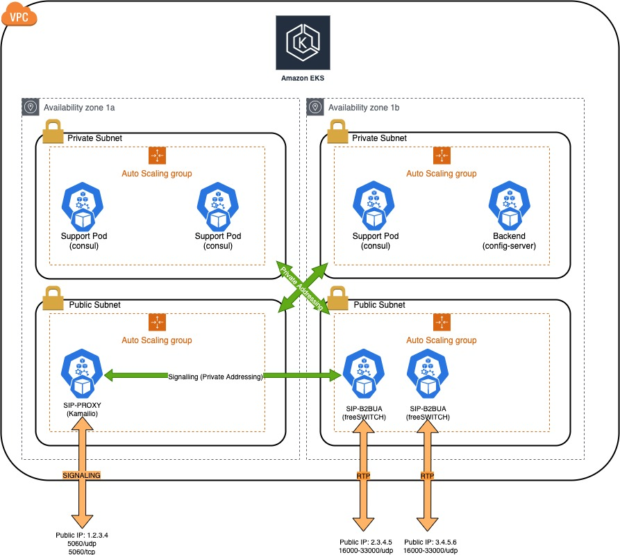

# Full VoIP service on kubernetes.

The goal of this project is to provide people with a complete, fully-fledge VoIP platform based on Kubernetes.

It is based on AWS EKS and consists of two parts:

The first is the Terraform project, which will create all resources needed to implement:
- 1 EKS cluster with the following nodes:
  - 1 backend (1 node in a private subnet): this will run the Consul service and the Routing Service (based on FS XML_CURL) pods
  - 1 Proxy (1 node in a public subnet): this will run Kamailio in a pod.
  - 2 B2BUA (2 nodes in a public subnet): These will run freeSWITCH. Signaling will run on the private IPs while RTP will use a public IP.

The clients will register (if configured) on the Proxy's public IP address. When they make/receive calls via this address. The Proxy will forward all calls to the FS's on the private IPs, then negotiate with the clien an RTP connection via FS's public IPs.

# Architecture:


# Resources Created by the project

- VPC (Including IGW, RouteTables, etc)
- EKS cluster
- RDS database
- Support ASG (You can configure all node types in `terraform/project/main/dev.vars.json`:
  - 3 support nodes for consul (required for state consensus, they can be small types)
- SIP-PROXY ASG:
  - 1 SIP-PROXY node (Kamailio)
- Backend ASG:
  - 1 config-server node
- B2BUA ASG:
  - 1 B2BUA node (freeSWITCH)

---
# Requirements
## 

- You need to have an AWS account properly configured in your CLI.
- The AWS account secret_access_key and accrss_key_id should already be properly configured in your ~/.aws/credential file. 
  - Make sure you export the Environment Variables like so:
    - `export AWS_PROFILE=[your-aws-profile-as-named-in-the-credentials-file]`
- You <b>MUST</b> create an ssh keypair EC2->Key Pairs, name it something and set it on the variables file (see "Prepare your deployment")
- Said account must have all permissions to create a VPC, routing tables, EKS cluster, ASGs, etc.
- You must have installed and properly configured the following:
  - helm (https://helm.sh/docs/intro/install/)
  - kubectl (https://kubernetes.io/docs/tasks/tools/install-kubectl-linux/)
  - AWS cli utility (https://docs.aws.amazon.com/cli/latest/userguide/install-cliv2.html)


# Docker Images

When you create the platform, kubernetes will pull 3 images off of my dockerhub repo (https://hub.docker.com/orgs/vikingvoip/repositories)
The images pulled are:
- Kamailio Proxy Server version 5.3
- freeSWITCH version 1.10
- Config Server, this is an nginx server with some php scripts to server the dialplan to freeSWITCH as well as a script to parse and insert the CDRs into the database.

# Services out of the box

- User-to-user calling:
  When a registered user calls another local user, the call always goes to the B2BUA so that the RTP is anchored there. The call is then forwarded to the proxy, who then does the actual location lookup and forward to the B-user.
- User-to-termination provider:
  I'll provide a variable on dev.vars.json so that you can do outbound termination.
- Voicemail:
  When a local user is called and is not registered, the incoming calls goes to Voicemail. This was implemented accross all avaiable freeSWITCHes by creating an EFS and attaching it to all SIP-B2BUA, so the recordings are available to all.

To do:

- Support for REFER/Transfer by remembering where a user's call sent and if we receive another call for that user, send it to the same B2BUA.
- Some kind of UI to create new subscribers.
- Some kind of UI to add new termination providers.
- Some kind of UI to add new origination providers.
- Some kind of UI to create a route table based on the number diales (LCR).

# Deploy
## Makefile

- ```make help```: Will give you all possible directives, i.e.:
- ```make init-backend```: Will initialize the s3_backend, meaning preparing all plugins needed by terraform.
- ```make apply-backend```: Will apply the s3_backend terraform. This will create an S3 bucket and a DynamoDB table which are used to keep track of the state of terraform deployments in relation to resrouces in AWS. (Includes all previous directives)
- ```make init-main```: Will initialize the main projecyt, meaning preparing all plugins needed by that terraform project.
- ```make apply-backend```: Will apply the main terraform project. This will create all needed resources to deploy the whole eks platform.
- ```make destroy-main```: Will delete all resources previously created by the main project. (it is possible the destroy doesn't work because sometimes a previsouly created ELB is not destroyed. If this happens, you will need to manually delete the ELB and execute the destroy agaon. We're investigating into that.)
- ```make destroy-backend```: Will delete the backend resources created for state management.

---

# Prepare your deployment
##

Clone the repo

```git clone git@github.com:Viking-VoIP/full-voip-on-k8s.git viking-voip```

cd into the project folder:

```cd viking-voip```

*IMPORTANT*: The variable file contains all the information needed to deploy the complete solution. There are parameters you will probably want to change.

Use your favorite edit to edit the variables file:

`terraform/project/main/dev.vars.json`

A few variables are special:
- `local_subscribers_regexp: "^7[0-9]{8}"`: This is a regexp representing the numbers you'll be assigning to you subscribers, in this case 700000000-799999999. The SIP-PROXY will detect calls to these numbers and forward them to the B2BUA so the rtp is anchored there and you don't have any audio issues.
- `region: "us-east-1"`: The AWS region in which to deploy the platform.
- `db_username: "admin"`: The database (RDS) username
- `db_password: "AbC123fgh#"`: The databse (RDS) password

*Please review the vars file to set the instance type you want* 


To build the whole project simply execute:

```make apply-main``` 

This will launch the deployment process.

If everything goes OK, you will get an output of your setup, you should save this somewhere safe.

*NOTE*: You should at least change dev.vars.json for the db password.

---
## What next?

Subscribers are not created by default, you will need to add them manually. To do this you can execute something like:


*Get the proxy's pod*
```
POD=$(k get pods -o json | jq ".items[]|.metadata|select(.name|test(\"sip-proxy.\"))|.name" | sed "s/\"//g"))
```

*Set a couple var*
```
USER=721110000
PASS=whatever
```

*Get the domain from dev.vars.json*
```
DOMAIN=(kubectl exec -t consul-consul-server-0 -- /bin/consul kv get voice/proxy-public-ip | sed "s/\"//g")
```

*Create the user via sip-proxy*
```
kubectl exec -ti $POD -- kamctl add $USER@$DOMAIN $PASS
```

Or you can add them straight on the database.
