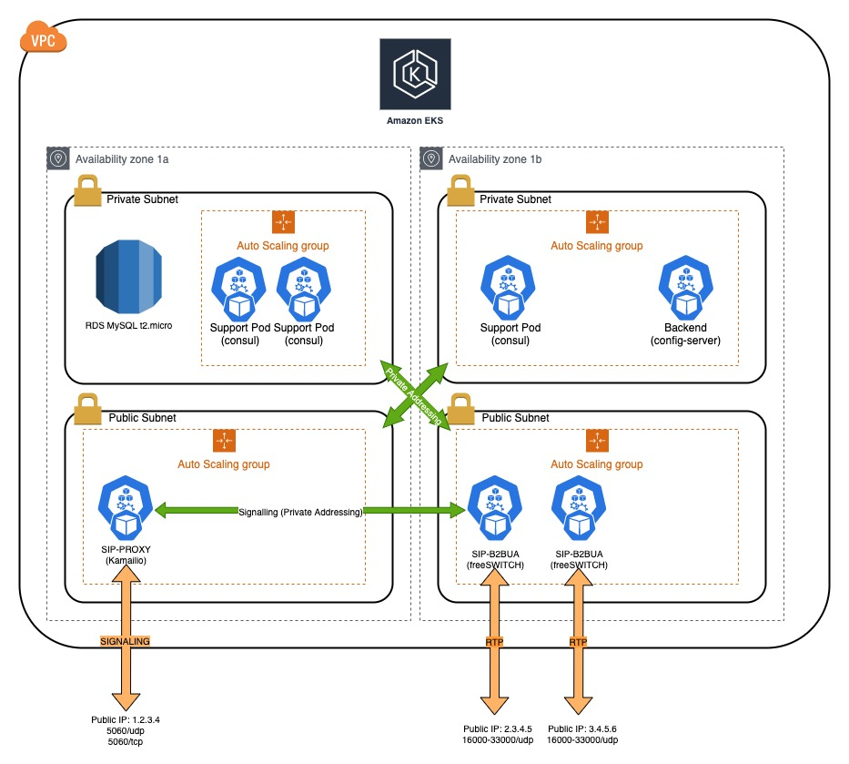

# Full VoIP service on kubernetes.

The goal of this project is to provide people with a complete, fully-fledge VoIP platform based on Kubernetes.

It is based on AWS EKS and consists of two parts:

The first is the Terraform project, which will create all resources needed to implement:
- 1 EKS cluster with the following nodes:
  - 1 backend (1 node in a private subnet): this will run the Consul service and the Routing Service (based on FS XML_CURL) pods
  - 1 Proxy (1 node in a public subnet): this will run Kamailio in a pod.
  - 2 B2BUA (2 nodes in a public subnet): These will run freeSWITCH. Signaling will run on the private IPs while RTP will use a public IP.

The clients will register (if configured) on the Proxy's public IP address. When they make/receive calls via this address. The Proxy will forward all calls to the FS's on the private IPs, then negotiate with the clien an RTP connection via FS's public IPs.

# Architecture:


---
# Requirements
## 

- You need to have an AWS account properly configured in your CLI.
- Said account must have all permissions to create a VPC, routing tables, EKS cluster, ASGs, etc.
- You must have installed and properly configured the following:
  - helm (https://helm.sh/docs/intro/install/)
  - kubectl (https://kubernetes.io/docs/tasks/tools/install-kubectl-linux/)
  - AWS cli utility (https://docs.aws.amazon.com/cli/latest/userguide/install-cliv2.html)

# Prepare your deployment
##

Clone the repo

```git clone git@github.com:Viking-VoIP/full-voip-on-k8s.git```

cd into the terraform project folder:

```cd terraform/project/main```

*IMPORTANT*: The variable file contains all the information needed to deploy the complete solution. There are parameters you will probably want to change.

Use your favorite edit to edit the variables file:

`dev.vars.json`


---
# Deploy
## 

Execute terraform:

```terraform apply -var-file=dev.vars.json```

If everything goes OK, you will get an output of your setup, you should save this somewhere safe.

Then cd into `scripts` by doing ```cd ../../../scripts```
Here, you want to execute:

```bash init.sh```


*NOTE*: If you don't change dev.vars.json, but I'd recommend at least chnaging the admin db password.
